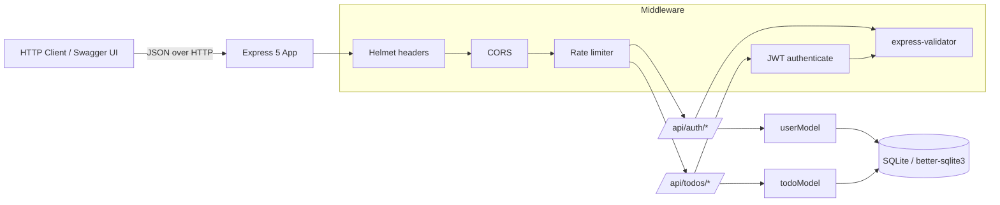

# RESTful To-Do API — Step-by-Step Build Guide

> **Archived: original build playbook.** This document is the original roadmap used to build the RESTful To-Do API from an empty folder to a deployed service. It is intentionally self-contained: each step can be executed in order to reproduce the project. The codebase may have evolved since this guide was written, so treat it as a making-of narrative rather than the source of truth. For current setup, architecture, and deployment notes, see [../README.md](../README.md).

---

> **Project Summary:** A secure, production-minded RESTful API for managing personal to-do items. Users register and log in to receive a JWT, then perform full CRUD over their own todos with priority levels, completion toggling, pagination, filtering, and sorting. Every todo is scoped to its owner, so users can never read or mutate another user's data. Security layers include bcrypt password hashing, JWT authentication, Helmet HTTP headers, CORS origin control, request rate limiting, declarative input validation, and startup environment validation. The stack is Node.js + Express 5 with a file-based SQLite database via better-sqlite3, interactive Swagger documentation, and a Jest + Supertest integration test suite running against an isolated in-memory database.

Each step below is a self-contained prompt. Execute them in order.

Stack: Node.js 20.x, Express 5, better-sqlite3 (SQLite), jsonwebtoken, bcryptjs, express-validator, Helmet, express-rate-limit, swagger-jsdoc + swagger-ui-express, dotenv, CORS, Jest + Supertest, Nodemon.

---

## Table of Contents

**PHASE 1 — Backend Foundation**

- STEP 1 — Project Scaffolding & Dependency Setup
- STEP 2 — Environment Validation
- STEP 3 — Database Connection & Schema
- STEP 4 — Standardized API Responses
- STEP 5 — Error Handling Middleware

**PHASE 2 — Backend Resources**

- STEP 6 — User Model & Authentication Middleware
- STEP 7 — Validation & Rate Limiting Middleware
- STEP 8 — Auth Routes (Register, Login, Me)
- STEP 9 — Pagination Utilities
- STEP 10 — Todo Model (Data Access Layer)
- STEP 11 — Todo Routes (CRUD, Toggle, Filters)

**PHASE 3 — Security, Docs & App Wiring**

- STEP 12 — Swagger / OpenAPI Configuration
- STEP 13 — Application Entry Point & Middleware Wiring
- STEP 14 — Welcome Page & Health Check

**PHASE 4 — Testing**

- STEP 15 — Test Harness & Database Isolation
- STEP 16 — Auth & Todo Integration Tests

**PHASE 5 — Polish & Deploy**

- STEP 17 — Community Health Files & Documentation
- STEP 18 — Production Hardening & Deployment

**Appendices**

- Appendix A — Shared Constants & Conventions
- Appendix B — Common Pitfalls
- Appendix C — Pre-flight Checklist

---

## Global Build Rules (apply to EVERY step)

- **No git operations.** Do not run, suggest, or automate `git` commands. Do not commit, push, branch, or tag. Version control is handled manually by the user.
- **No unapproved packages.** Only install the dependencies named in a step. Prefer native methods and avoid unnecessary dependencies.
- **No long-running processes** (dev servers, watchers) unless the step or the user explicitly requests them.
- **Each step is self-contained.** Assume the working directory is the project root and prior steps are complete.
- **Code quality.** Keep code clean, readable, and modern (ES6+, `async/await`). Use descriptive English identifiers in `camelCase`. Follow DRY and keep modules reusable and testable.
- **Security first.** Never commit secrets. Validate and sanitize all input. Parameterize every SQL statement.
- **Run diagnostics** after substantive edits and fix any linter errors you introduce.

---

## Architecture at a Glance



The Express app applies global security middleware (Helmet, CORS, rate limiting), then routes requests to two routers. `/api/auth` handles registration and login (public, rate-limited) plus the authenticated `/me` endpoint. `/api/todos` is fully protected by JWT authentication and delegates persistence to the model layer. Models are the only code that talks to SQLite, using prepared statements. Responses are normalized through shared helpers, and errors funnel through a global error handler.

---

# PHASE 1 — BACKEND FOUNDATION

---

## STEP 1 — Project Scaffolding & Dependency Setup

**Goal:** Initialize the Node project, install dependencies, and create the source folder layout.

**Files/folders to create:**

- `package.json`
- `.gitignore`
- `.env`, `.env.example`
- `src/`, `src/config/`, `src/middleware/`, `src/models/`, `src/routes/`, `src/utils/`, `tests/`, `data/`

**Dependencies:**

```bash
npm init -y
npm install express cors helmet better-sqlite3 jsonwebtoken bcryptjs express-validator express-rate-limit swagger-jsdoc swagger-ui-express dotenv
npm install --save-dev nodemon jest supertest cross-env
```

**Implementation notes:**

- Set `"type": "commonjs"`, `"main": "src/app.js"`, and Node engine `20.x` in `package.json`.
- Add scripts:

```json
{
  "scripts": {
    "start": "node src/app.js",
    "dev": "nodemon src/app.js",
    "test": "cross-env NODE_ENV=test DATABASE_PATH=:memory: JWT_SECRET=test-secret jest --runInBand",
    "test:watch": "cross-env NODE_ENV=test DATABASE_PATH=:memory: JWT_SECRET=test-secret jest --runInBand --watch"
  },
  "jest": {
    "testEnvironment": "node",
    "testMatch": ["**/tests/**/*.test.js"]
  }
}
```

- `.gitignore` must include `node_modules/`, `data/`, `.env`, `*.db`, `*.db-wal`, `*.db-shm`.
- `.env.example` documents every variable; the real `.env` stays untracked.

**Acceptance checklist:**

- [ ] `npm install` completes without errors.
- [ ] Folder layout exists and `.env` is gitignored.

---

## STEP 2 — Environment Validation

**Goal:** Fail fast on startup if required environment variables are missing or insecure.

**Files to create:** `src/config/env.js`

**Implementation notes:**

- Export `validateEnv()` that throws when `JWT_SECRET` is missing.
- In `production`, reject the known default/placeholder secret.
- Return a typed config object: `{ port, nodeEnv, jwtSecret, jwtExpiresIn, corsOrigin }` with sensible defaults (`port` 3000, `nodeEnv` development, `jwtExpiresIn` 7d, `corsOrigin` `*`).

```js
const REQUIRED_VARS = ["JWT_SECRET"];

const validateEnv = () => {
  const missing = REQUIRED_VARS.filter((key) => !process.env[key]);
  if (missing.length > 0) {
    throw new Error(`Missing required environment variables: ${missing.join(", ")}.`);
  }
  return {
    port: parseInt(process.env.PORT, 10) || 3000,
    nodeEnv: process.env.NODE_ENV || "development",
    jwtSecret: process.env.JWT_SECRET,
    jwtExpiresIn: process.env.JWT_EXPIRES_IN || "7d",
    corsOrigin: process.env.CORS_ORIGIN || "*",
  };
};

module.exports = { validateEnv };
```

**Acceptance checklist:**

- [ ] Importing and calling `validateEnv()` without `JWT_SECRET` throws a clear error.

---

## STEP 3 — Database Connection & Schema

**Goal:** Provide a singleton SQLite connection and create tables/indexes on first use.

**Files to create:** `src/config/database.js`

**Implementation notes:**

- Resolve the DB path from `process.env.DATABASE_PATH` (falling back to `data/todo.db`) so tests can use `:memory:`.
- Enable WAL mode for file-based databases only; always enable `foreign_keys`.
- Create `users` and `todos` tables with a `priority` CHECK constraint (`low`/`medium`/`high`) and a `user_id` foreign key with `ON DELETE CASCADE`.
- Add indexes on `todos(user_id)`, `todos(priority)`, `todos(completed)`.
- Export `getDatabase()` and `closeDatabase()`.

**Security/performance:** Foreign keys enforce ownership integrity; indexes keep filtered/paginated reads fast.

**Acceptance checklist:**

- [ ] First call to `getDatabase()` creates the schema; subsequent calls reuse the connection.

---

## STEP 4 — Standardized API Responses

**Goal:** Guarantee a consistent JSON envelope for every response.

**Files to create:** `src/utils/apiResponse.js`

**Implementation notes:**

- `sendSuccess(res, { data, message, statusCode, meta })` → `{ success: true, message, data, meta? }`.
- `sendError(res, { message, statusCode, errors })` → `{ success: false, message, errors? }`.
- `meta` and `errors` are only included when present.

**Acceptance checklist:**

- [ ] Both helpers set the HTTP status and return the JSON envelope.

---

## STEP 5 — Error Handling Middleware

**Goal:** Centralize 404 and unhandled error responses.

**Files to create:** `src/middleware/errorHandler.js`

**Implementation notes:**

- `notFoundHandler` returns 404 with the attempted method and URL.
- `globalErrorHandler(err, req, res, next)` logs the error, hides internals in production, and reuses `sendError`.

**Acceptance checklist:**

- [ ] Unknown routes return a structured 404; thrown errors return a structured 500.

---

# PHASE 2 — BACKEND RESOURCES

---

## STEP 6 — User Model & Authentication Middleware

**Goal:** Implement user persistence and JWT verification.

**Files to create:** `src/models/userModel.js`, `src/middleware/auth.js`

**Implementation notes:**

- `userModel` exposes `createUser`, `findUserById` (no password), `findUserByEmail`, `findUserByUsername`. Use prepared statements.
- `authenticate` reads the `Authorization: Bearer <token>` header, verifies it with `jwt.verify`, and attaches `req.user = { id, username }`. Return 401 on a missing or invalid token.

**Security:** Never select the password hash in `findUserById`; only `findUserByEmail` (used for login) returns it.

**Acceptance checklist:**

- [ ] Protected routes reject requests without a valid token.

---

## STEP 7 — Validation & Rate Limiting Middleware

**Goal:** Convert express-validator results into the standard error format and throttle abusive traffic.

**Files to create:** `src/middleware/validate.js`, `src/middleware/rateLimiter.js`

**Implementation notes:**

- `validate` runs `validationResult`, maps errors to `{ field, message }`, and returns 422 when invalid.
- `rateLimiter` exports `authLimiter` (strict: ~10 requests / 15 min) and `apiLimiter` (~200 requests / 15 min). Both return `429` with the standard error shape.
- Bypass limiting when `NODE_ENV === "test"` so tests stay deterministic.

**Acceptance checklist:**

- [ ] Invalid payloads return 422 with a `errors` array.
- [ ] Limiters are no-ops under the test environment.

---

## STEP 8 — Auth Routes (Register, Login, Me)

**Goal:** Expose registration, login, and current-user endpoints.

**Files to create:** `src/routes/authRoutes.js`

**Dependencies used:** `bcryptjs`, `jsonwebtoken`.

**Implementation notes:**

- Apply `authLimiter` to `POST /register` and `POST /login`.
- Validate input: username (3–30, alphanumeric), email (valid + normalized), password (min 6).
- Hash passwords with bcrypt (`SALT_ROUNDS = 12`).
- Reject duplicate email/username with 409.
- `generateToken` signs `{ id, username }` with `JWT_SECRET` and `JWT_EXPIRES_IN`.
- Never return the password hash; strip it before responding.
- `GET /me` is protected by `authenticate` and returns the current user.

**Acceptance checklist:**

- [ ] Register returns 201 with `{ user, token }`; duplicates return 409; bad input returns 422.
- [ ] Login returns a token for valid credentials and 401 otherwise.

---

## STEP 9 — Pagination Utilities

**Goal:** Parse pagination query params and build pagination metadata.

**Files to create:** `src/utils/pagination.js`

**Implementation notes:**

- `parsePagination(query)` clamps `page >= 1`, `1 <= limit <= 100` (defaults 1 / 10) and computes `offset`.
- `buildPaginationMeta(page, limit, totalItems)` returns `currentPage`, `itemsPerPage`, `totalItems`, `totalPages`, `hasNextPage`, `hasPreviousPage`.

**Acceptance checklist:**

- [ ] Out-of-range inputs are clamped; metadata math is correct.

---

## STEP 10 — Todo Model (Data Access Layer)

**Goal:** Implement owner-scoped CRUD and filtered, sorted, paginated reads.

**Files to create:** `src/models/todoModel.js`

**Implementation notes:**

- Every query includes `user_id = ?` so todos are owner-scoped.
- `findTodos` builds a dynamic `WHERE` from optional `completed` and `priority` filters, validates `sortBy` against a whitelist, and forces `order` to `ASC`/`DESC` to prevent SQL injection. Return `{ todos, total }`.
- `createTodo`, `findTodoById`, `updateTodo` (partial update + `updated_at`), `deleteTodo`, `toggleTodoCompleted`.

**Security:** Whitelisting the sort column and coercing the order keyword blocks injection through query params.

**Acceptance checklist:**

- [ ] A user cannot fetch or mutate another user's todo (returns not-found).

---

## STEP 11 — Todo Routes (CRUD, Toggle, Filters)

**Goal:** Expose the full todo REST surface, protected by JWT.

**Files to create:** `src/routes/todoRoutes.js`

**Implementation notes:**

- `router.use(authenticate)` protects all todo endpoints.
- Endpoints: `GET /` (list with pagination/filter/sort), `GET /:id`, `POST /`, `PUT /:id`, `PATCH /:id/toggle`, `DELETE /:id`.
- Validate query params, path `id` (positive integer), and body fields (title 1–255, priority enum, completed boolean).
- For mutations, verify ownership first and return 404 when the todo is absent.

**Acceptance checklist:**

- [ ] All six operations work end-to-end and enforce ownership and validation.

---

# PHASE 3 — SECURITY, DOCS & APP WIRING

---

## STEP 12 — Swagger / OpenAPI Configuration

**Goal:** Generate interactive API docs from JSDoc annotations.

**Files to create:** `src/config/swagger.js`

**Implementation notes:**

- Configure OpenAPI 3.0 with `BearerAuth` security scheme and reusable schemas (`User`, `Todo`, `PaginationMeta`, `SuccessResponse`, `ErrorResponse`).
- Switch the `servers` entry based on `NODE_ENV` (production `API_URL` vs local).
- Point `apis` at `./src/routes/*.js` and `./src/app.js`.
- Annotate each route with `@swagger` JSDoc blocks.

**Acceptance checklist:**

- [ ] `/api-docs` renders all endpoints with the Bearer auth control.

---

## STEP 13 — Application Entry Point & Middleware Wiring

**Goal:** Compose the app, apply security middleware, mount routes, and manage lifecycle.

**Files to create:** `src/app.js`

**Implementation notes:**

- Load `dotenv`, then call `validateEnv()` and use the returned config.
- Ensure the `data/` directory exists, then initialize the database.
- `app.set("trust proxy", 1)` for correct client IPs behind a proxy (e.g., Render).
- Apply `helmet({ contentSecurityPolicy: false })` (the welcome page and Swagger UI use inline assets), CORS built from `corsOrigin`, and `express.json({ limit: "10kb" })`.
- Mount Swagger at `/api-docs`, apply `apiLimiter` to `/api`, then mount `/api/auth` and `/api/todos`.
- Register `notFoundHandler` and `globalErrorHandler` last.
- Start the server only when `nodeEnv !== "test"` so Supertest can import the app without binding a port. Handle `SIGTERM`/`SIGINT` for graceful shutdown. Export `app`.

**Acceptance checklist:**

- [ ] Server boots, security headers are present, and importing the app under test does not start a listener.

---

## STEP 14 — Welcome Page & Health Check

**Goal:** Provide a branded landing page and a health probe.

**Files to edit:** `src/app.js`

**Implementation notes:**

- `GET /` returns a styled HTML welcome page linking to `/api-docs` and `/api/health`.
- `GET /api/health` returns `{ status: "ok", timestamp }`.
- Accessibility: use semantic HTML, sufficient color contrast, and `rel="noopener noreferrer"` on external links.

**Acceptance checklist:**

- [ ] `/` renders and `/api/health` returns 200 JSON.

---

# PHASE 4 — TESTING

---

## STEP 15 — Test Harness & Database Isolation

**Goal:** Run tests against an isolated in-memory database with rate limiting disabled.

**Files to edit/verify:** `package.json` (jest config + scripts), `src/config/database.js`, `src/middleware/rateLimiter.js`

**Implementation notes:**

- The `test` script sets `NODE_ENV=test`, `DATABASE_PATH=:memory:`, and a test `JWT_SECRET` via `cross-env`.
- `--runInBand` keeps SQLite access sequential and deterministic.
- Confirm the database module honors `:memory:` and the limiters short-circuit under test.

**Acceptance checklist:**

- [ ] Tests never write to `data/todo.db`.

---

## STEP 16 — Auth & Todo Integration Tests

**Goal:** Cover the API end-to-end with Supertest.

**Files to create:** `tests/auth.test.js`, `tests/todos.test.js`

**Implementation notes:**

- Auth: registration success, duplicate email (409), validation (422), login success/failure (401), `/me` with and without a token.
- Todos: auth required (401), create + validation, list with pagination meta, priority filter, full lifecycle (create → get → update → toggle → delete → 404), and cross-user isolation (another user gets 404).
- Import the app directly (`require("../src/app")`); no live server needed.

**Acceptance checklist:**

- [ ] `npm test` passes all suites.

---

# PHASE 5 — POLISH & DEPLOY

---

## STEP 17 — Community Health Files & Documentation

**Goal:** Add GitHub community standards and a complete README.

**Files to create:** `.github/CODE_OF_CONDUCT.md`, `.github/CONTRIBUTING.md`, `.github/SECURITY.md`, `.github/PULL_REQUEST_TEMPLATE.md`, `.github/ISSUE_TEMPLATE/{bug_report.yml,feature_request.yml,config.yml}`, `README.md`, `LICENSE`

**Implementation notes:**

- Keep community health files under `.github/` so GitHub auto-detects them.
- README documents features, env vars, installation, testing, endpoints, and project structure.
- Use the MIT license.

**Acceptance checklist:**

- [ ] README reflects the real implementation; community files resolve on GitHub.

---

## STEP 18 — Production Hardening & Deployment

**Goal:** Prepare and deploy the service safely.

**Implementation notes:**

- Set a strong, unique `JWT_SECRET` in the host's environment; never reuse the placeholder.
- Set `NODE_ENV=production` and restrict `CORS_ORIGIN` to known front-end origins.
- Ensure the host persists the `data/` directory (or migrate to a managed database for multi-instance deployments — SQLite is single-writer).
- Confirm `trust proxy` is enabled so rate limiting sees real client IPs.
- Deploy (e.g., Render): build command `npm install`, start command `npm start`.

**Acceptance checklist:**

- [ ] Production boot succeeds only with a strong secret; docs and health endpoints respond.

---

# Appendix A — Shared Constants & Conventions

- **Response envelope:** `{ success, message, data, meta? }` (success) and `{ success: false, message, errors? }` (error).
- **Status codes:** 200 OK, 201 Created, 401 Unauthorized, 404 Not Found, 409 Conflict, 422 Validation, 429 Too Many Requests, 500 Internal.
- **Priority enum:** `low` | `medium` | `high` (default `medium`).
- **Sort whitelist:** `created_at`, `updated_at`, `priority`, `title`; order `ASC`/`DESC` (default `DESC`).
- **Pagination defaults:** `page` 1, `limit` 10, `MAX_LIMIT` 100.
- **Bcrypt:** `SALT_ROUNDS = 12`.
- **Naming:** English, descriptive, `camelCase` for variables/functions.

---

# Appendix B — Common Pitfalls

- **Helmet CSP breaks inline UI.** The default Content-Security-Policy blocks the inline-styled welcome page and Swagger UI; disable CSP (`contentSecurityPolicy: false`) or define an explicit policy.
- **Listening during tests.** Calling `app.listen` unconditionally makes Supertest bind a real port; guard it behind `nodeEnv !== "test"`.
- **dotenv overriding test env.** `dotenv` does not override already-set variables, so `cross-env` values win — keep it that way.
- **SQL injection via sort params.** Never interpolate raw `sortBy`/`order` values; whitelist the column and coerce the direction.
- **Leaking password hashes.** Strip the password before returning a user object.
- **Rate limiter + proxy.** Without `trust proxy`, all requests can appear to share one IP, skewing limits.
- **SQLite concurrency.** SQLite is single-writer; for horizontally scaled deployments, migrate to a client/server database.

---

# Appendix C — Pre-flight Checklist

- [ ] `.env` present locally and gitignored; `.env.example` documents every variable.
- [ ] `JWT_SECRET` set and strong in every environment.
- [ ] `npm test` passes against the in-memory database.
- [ ] `/`, `/api/health`, and `/api-docs` respond.
- [ ] Security headers present (Helmet) and CORS restricted in production.
- [ ] Rate limiting active outside the test environment.
- [ ] No secrets committed; no linter errors introduced.
